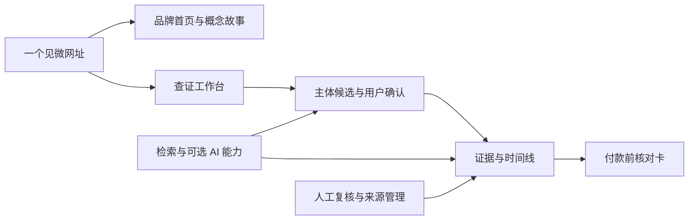
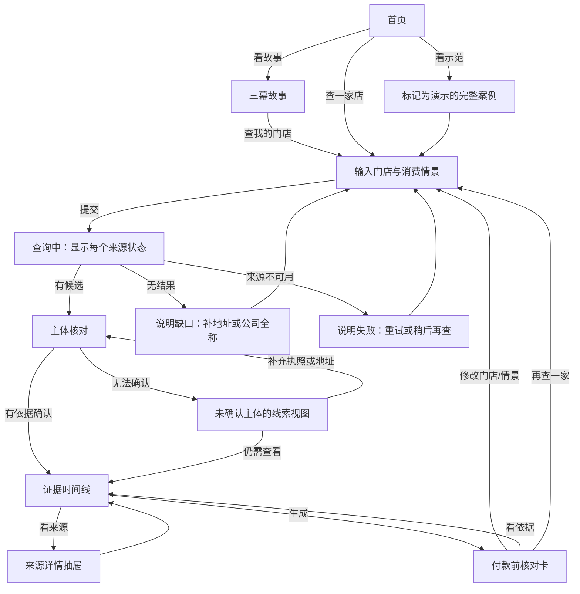

# 见微｜产品形态与体验蓝图

版本：2026-10-03 · 用途：比赛展示、设计评审、第一版开发对齐

> **决策状态：候选方案 A，尚未验证为最优。** 本文描述“消费者办卡前查证 + 响应式 Web”的完整实现路径，供比较和测试。比赛规则、目标用户、数据获取能力、用户测试和付费意愿尚未充分验证；通过文末决策关卡后才能定为最终产品方案。

## 1. 产品决定

**当前优先测试的产品形态：一个响应式 Web 产品。** 同一个网址包含品牌首页、概念故事和查证工作台；电脑端用于完整阅读与现场演示，手机浏览器用于消费者在门店付款前快速查询。第一版设想无需安装、无需注册即可开始查证。是否先做微信小程序，取决于比赛要求和真实用户的入口测试。原生 App 暂不立项。

如果讨论中的“A件团”指 AI Agent，它是后端执行检索、归纳和反证检查的**能力模块**，不是产品入口，也不能代替来源核验。界面始终用“来源、核验状态、下一步问题”解释结果。

**产品名：见微。** X-Ray 是项目与技术代号，对外主品牌统一为“见微”。

**当前优先测试的场景：健身房年卡或私教课的长期预付前查证。** 后续是否复制到美容、培训等预付服务，取决于主体匹配和来源覆盖情况；比赛演示和第一批用户访谈先讲一个场景。用户正在考虑付一笔钱，需要知道门店由谁经营、近期有哪些可核对的公开变化、合同和付款前该问什么。

**核心承诺：**“办卡前，先看清招牌背后的经营者和公开线索。”产品提供查证记录与行动清单，不输出“安全/危险”分数、倒闭预测或付款保证。

## 2. 为什么采用这个形式

| 选项 | 本阶段决定 | 原因 |
|---|---|---|
| 响应式网站 / Web 应用 | **优先测试的主载体** | 用户点链接即用，适合搜索、分享、手机访问和比赛大屏演示；现有 React + FastAPI 工程可直接演进。是否有足够的真实使用率仍需测试。 |
| 微信小程序 | 平行比较的候选入口 | 如果用户主要在门店扫码、从微信转发进入，或比赛要求小程序交付，应提前成为主入口；服务端查证逻辑可复用。 |
| 原生 App | 暂缓 | 当前不是高频、重度日常使用场景，下载安装会增加首次使用门槛。 |
| AI Agent | 后台辅助能力 | 可以帮助找候选、整理线索和寻找相反解释；所有输出必须标明证据等级，无法确认时停止下结论。 |

### 对外的 15 秒说明

“准备给一家店办年卡时，搜到的信息常常对应不上实际收钱的公司。见微先帮你核对经营主体，再把有出处的公开变化排成时间线，最后给出付款前最值得问的几个问题。”

## 3. 产品目录与跳转

路径是目标信息架构；当前工程仍主要由单页 `frontend/src/App.tsx` 承载，不代表以下页面已开发。

| 页面 / 路径 | 主要内容 | 入口 | 主要出口 |
|---|---|---|---|
| 首页 `/` | 一句话价值、主搜索框、三步方法、示例入口、故事入口 | 直接访问或返回首页 | 开始查证、看概念故事、看示例 |
| 概念故事 `/story` | 一个明确标为虚构的“办卡前”故事，展示招牌→主体→证据→行动 | 首页导航与首屏次按钮 | 带着同一问题返回搜索；保留已填写草稿 |
| 方法与边界 `/method` | 数据从哪里来、什么算已核实、无法确认会怎样 | 首页导航、报告页“怎么算” | 返回原页面与滚动位置 |
| 新建查证 `/investigations/new` | 门店/品牌、城市或地址、消费意图、金额与期限 | 首页主按钮、故事结尾、报告“再查一家” | 查询中、输入修正 |
| 主体核对 `/investigations/:id/identity` | 候选经营主体、匹配依据与冲突、用户确认或“无法确认” | 查询完成 | 证据页，或保留“主体未确认”继续看线索 |
| 证据时间线 `/investigations/:id/evidence` | 官方事实、待核实线索、相反信息、来源缺口 | 主体核对完成或跳过 | 打开来源详情、生成核对卡 |
| 核对卡 `/investigations/:id/report` | 已知/未知/待问问题、用户预付情景、来源清单、查询时间 | 证据页 | 保存/导出、返回证据、再查一家 |
| 示范案例 `/examples/gym-card` | 使用标注的样例材料完成一次可重复的查证 | 首页“看一次完整查证” | 返回首页或开始自己的查证 |

全局导航只保留 **开始查证 / 看一个故事 / 方法与边界**。查证开始后改为进度导航 **输入 → 主体 → 证据 → 核对卡**，允许回到前一步修改；不让用户在营销首页的多个栏目中迷路。

## 4. 首页如何呈现“见微”的特色

### 首屏：一眼看懂用途

- 保留现有放大镜、档案盒和小女孩的视觉识别，但主标题旁必须直接出现中文产品句：“办卡前，先看清这家店”。现有 `SEE THE CHANGE` 可以作为视觉副标题。
- 第一主按钮：**查一家店**；第二按钮：**看一次完整查证**。搜索框可直接在首屏或首屏下一屏出现，不强迫用户先读长故事。
- 首屏下方放三个信任标签：**经营主体待核对 / 每条信息看出处 / 查不到会明说**。它们必须与真实产品行为一致。

### 故事入口：从概念转到任务

首页导航和首屏次按钮打开独立的 `/story`，采用 3 幕滚动故事，而非首次访问强制弹窗：

1. **招牌：**“我准备付 3999 元买 12 个月年卡。”画面只见门店招牌；旁边提问“钱付给谁？”
2. **档案：**放大镜移动后露出合同抬头、营业执照名称、公开记录的不同名称；说明同名、加盟和分店不能自动视为同一主体。
3. **决定：**把“已经确认、尚未确认、付款前要问”放进一张核对卡。结尾按钮“查我准备办卡的店”。

故事里的门店、金额和材料都明确标为**演示情景**。用户填写过的查询草稿应保留；从故事返回后，输入不会丢失。移动端将放大镜交互替换为点击/滑动揭示，避免依赖鼠标悬停。

### 首页剩余内容

顺序：**用户问题 → 三步方法 → 一张可展开的示范核对卡 → 来源与边界 → 开始查证**。不要在首页展示“历史训练模型”“调查智能体”作为卖点，直到它们实际接入并经过验证。原企业赊销演示移到单独的项目展示链接，不放在消费者查证页的主导航或页脚。

## 5. 完整用户流程

### 每一步用户看到什么

| 步骤 | 用户操作 | 系统反馈 | 完成条件 |
|---|---|---|---|
| 1. 输入 | 填门店名；城市/分店地址尽量补充；选首次办卡或续费；可填金额、期限 | 表单即时提示同名风险和可选字段用途 | 关键词有效，能够发起查询 |
| 2. 查询 | 等待或取消 | 逐项显示“公开搜索、企业登记、投诉公示”等实际接入状态；未接入不伪装成功 | 返回真实结果、无结果或不可用状态 |
| 3. 核对主体 | 从候选中确认，或选“我无法确认” | 展示名称、地区、地址和每一条匹配依据；候选默认不勾选 | 记录用户确认依据，或明确记为未确认 |
| 4. 看证据 | 浏览时间线，点开原文 | 每条有来源、发生/披露时间、涉及主体、核验等级；可看到后续澄清与冲突 | 用户可以分辨事实与线索 |
| 5. 看核对卡 | 根据自己的消费情景查看下一步 | 清楚分为“已确认、待确认、建议询问”；金额和期限只用于个性化清单，不被解释为风险概率 | 可保存或导出，且保留查询时间与来源 |

## 6. 状态与跳转规则

状态应按**查询、主体、证据、报告**分别记录，不能用一个笼统的“安全/危险”状态覆盖全流程。

| 维度 | 状态 | 界面与跳转规则 |
|---|---|---|
| 查询 | `idle / searching / leads_found / no_results / source_unavailable / partial_failure` | 查询中禁用重复提交，可取消；部分来源失败时仍展示成功来源和失败清单；无结果提供补充城市、地址或全称的返回入口。 |
| 主体 | `unconfirmed / candidates / user_confirmed / source_verified / conflicted` | 候选只说明“可能相关”；用户确认和来源核验分开记录；冲突时不生成针对该公司的确定性结论。 |
| 证据 | `search_lead / checked_source / verified_fact / outdated / conflicted / unavailable` | 搜索摘要永远只作线索；原文、主体、日期核验后才能升级；过时或冲突保留记录和解释。 |
| 核对卡 | `provisional / complete / stale` | 主体未确认或仅有搜索线索时只能生成“初步查证卡”；来源更新超出设定时效后提示重新核查；不能改写旧报告的查询日期。 |

**关键阻断条件：**主体未确认时，不把某公司的负面信息归到门店名下；来源不可用时，不生成“未发现风险”；没有可核验数据时，报告仍可输出“目前知道什么、缺什么、该问什么”，但不得显示可信度分数。

## 7. 核对卡的固定目录

1. **我准备做什么：**门店、分店、首次办卡/续费、预付金额与服务期限；用户未填写时显示“未提供”。
2. **经营主体：**确认名称、确认依据、仍有疑点；涉及加盟/分店时单独标注。
3. **时间线：**已核实的登记、公告、投诉公示等事实，按时间排序；注明主体和原文。
4. **其他线索：**新闻或网页搜索摘要，明确“尚未独立核验”。
5. **资料缺口与相反信息：**查不到哪些来源；是否有更新、澄清或不同解释。
6. **付款前最值得问的 3 个问题：**根据消费情景生成，例如合同抬头、实际收款方、未使用服务的处理约定。
7. **查证记录：**查询时间、来源链接、材料日期、核验状态、产品能力覆盖。

报告页顶部先给出简明结论句式：“这家店的经营主体〔已确认/待确认〕；本次查到〔N〕条已核实事实和〔M〕条待核实线索；付款前建议先核对〔问题〕。”这里的数量必须来自真实数据，不能用演示数据替代在线查询。

## 8. 比赛演示的优势与 3 分钟路线

**希望让评委记住的差异：见微会展示自己不知道什么。** 见微把“门店与公司是否同一主体”放在第一关，随后展示证据等级、时间线和可执行问题。这是待验证的产品差异，需通过现场用户测试和同类产品比较确认。官方公示平台已经能分别查询企业信息与投诉信息；见微拟围绕一次具体消费决策组织不同来源和核对过程，不声称独占这些数据。

| 时间 | 画面 | 要让评委看到的能力 |
|---|---|---|
| 0–20 秒 | 放大镜首屏与故事第一幕 | 一个明确的消费时刻：准备付一笔年卡钱。 |
| 20–50 秒 | 输入门店和城市、金额、期限 | 真实问题进入系统；同时展示可重复的示范案例入口。 |
| 50–90 秒 | 主体候选页 | 不把品牌、门店、公司自动等同；允许“无法确认”。 |
| 90–140 秒 | 证据时间线和原文抽屉 | 每条线索有状态、来源、日期、涉及主体。 |
| 140–180 秒 | 核对卡 | 已知、未知、下一步问题；导出后可用于线下提问。 |

现场应准备**一条来源已缓存、显著标注为示范案例的稳定路线**，另保留“随机关键词实时查询”作为能力展示。随机查询失败时展示真实失败状态，不切换成未标注的预置结果。比赛材料需同时提供一个可点击网址、90 秒录屏、样例核对卡和一页数据来源说明。

## 9. 当前工程与目标版本的差距

| 现状（2026-10-03 代码） | 目标 | 优先级 |
|---|---|---|
| 首页已有“见微”视觉、故事气质和查证表单，但产品说明藏在滚动后 | 首屏中文价值、主按钮、示范案例、故事入口同时清楚 | P0 |
| 已接入高德地点搜索与地区列表、企查查企业模糊搜索和风险扫描适配器；本地尚无供应商密钥，未完成真实服务调用 | 配置并开通接口，做真实门店样本联调；进一步核对门店与企业的经营关系 | P0 |
| 金额、期限、意图提交给接口但未影响报告 | 用于生成个人化核对问题和支付前清单 | P0 |
| 企查查风险扫描结果可展开查看本次返回的全部字段，尚未形成可带走的核对卡 | 按第 7 节整合门店、主体关系、来源与消费情景并支持导出 | P0 |
| 历史训练模型、联网智能体只显示未接入 | 从首页卖点中移除；接入后再展示有证据的能力 | P0 |
| 原企业赊销演示仍在页脚 | 拆为独立项目展示，不进入见微用户流程 | P0 |
| 缺少查询持久化、来源复核和过期提醒 | 试点阶段加入追溯、人工复核与纠错入口 | P1 |

**第一版验收线：**任意真实关键词都能得到清楚的成功、无结果或不可用状态；主体未确认不会被误判为已确认；每条事实能打开原始来源；报告能准确记录已知与未知；手机端可完成从输入到核对卡的全过程。商业定价和大规模自动化放在试点验证后。

## 10. 把“最优解”变成可检验的选择

这里至少有两层选择：**服务谁、解决哪项决策**，以及**通过什么入口交付**。漂亮的页面只能证明展示效果，不能证明用户愿意用，也不能证明数据足以支持结论。

### 先比较产品主线

| 候选主线 | 已有证据 | 当前最大缺口 | 何时优先 |
|---|---|---|---|
| A. 消费者预付前查证（本文） | 已有见微品牌页面、任意关键词查询入口、来源与未知项的表达 | 目前主要是新闻搜索线索；门店主体核对和完整报告未落地 | 比赛强调用户体验、真实消费场景和产品设计；样本核验能证明数据覆盖 |
| B. 中小供应商赊销前核对与现金推演 | 已有可追溯的真实企业材料、可改参数的确定性现金引擎、可讲清的交易决策 | 只覆盖 1 家企业和 1 笔虚构订单；客户访谈和行业覆盖不足 | 比赛强调技术完整度、计算可复核、企业付费场景；能找到试点供应商 |

**在未拿到比赛评分表之前，不淘汰 B。** 若评分高度看重当前可运行能力，B 可能比 A 更强；若重视大众场景和产品故事，A 更有展示空间。这是基于仓库现状的判断，不是市场验证结果。

### 再比较交付入口

| 待验证问题 | 最小测试 | 会改变选择的结果 |
|---|---|---|
| 用户从哪里进入？ | 让目标用户分别通过网页链接与微信内入口完成同一个查证任务，记录开始率、完成率和分享行为 | 如果绝大多数真实使用发生在微信门店现场，且网页入口明显造成流失，优先小程序 |
| 用户要搜索框还是对话？ | 同一资料分别做表单流程与对话式原型，让用户找出经营主体和付款前问题 | 如果对话显著提高完成率且不降低事实核对准确率，再把 Agent 变成可见主交互 |
| 故事能否帮助理解？ | 比较有故事入口和直接查证入口的 30 秒理解率及任务完成率 | 如果故事让用户更慢进入查证而理解没有提升，把它降为独立品牌内容 |
| 健身场景能否形成可信报告？ | 抽取 30 家真实门店，人工双人核对招牌、地址、经营主体及来源可用性 | 如果主体无法稳定核对或来源覆盖过低，更换垂直场景或回到 B 方案 |

### 具体决策关卡

1. **比赛规则关：**拿到赛题、评分项、提交格式和现场网络条件。如果指定小程序、移动端或企业场景，立即调整载体与主线。
2. **数据可信关：**对 30 家目标门店制作人工标注样本。优先看“错误地把别家公司归给门店”的次数；试点样本内应为零，然后再看有多少案例能形成有用的报告。小样本通过只允许进入更大规模试点，不能证明今后不会发生误归属。
3. **用户任务关：**找至少 10 位近期有办卡/续费经历的人，让他们不用讲解完成查证。记录是否理解主体状态、能否找到原始来源、是否能说出自己下一步要问什么。
4. **入口关：**同一套内容用手机网页与小程序低保真原型比较实际到达和完成行为。只在入口证据支持时更换渠道。
5. **商业关：**先用人工辅助方式交付少量报告，询问用户是否愿意再次使用、分享或付费；没有真实行为前，收费方式只写为假设。

**决定原则：**先满足比赛硬要求和证据可信，再比较任务完成、使用入口与实现成本。如果 A 的主体核对做不可靠，应停止把它包装成“可信查证”并重新评估 B；如果 A 通过上述关卡，再将本文路线定为主方案。

## 11. 数据来源的现实边界

- [国家企业信用信息公示系统](https://bt.gsxt.gov.cn/)提供企业名称、统一社会信用代码及相关公示信息的查询入口。
- [全国 12315 消费投诉信息公示平台说明](https://www.samr.gov.cn/xw/zj/art/2023/art_32d884af3c7d4f9fbb1e5d2bb5f50aa9.html)说明公众可查询特定商家投诉情况。
- 上述**公众可查询**不等于本工程已经取得可用于自动化调用的接口或批量使用授权。接入前需验证实际获取方式、使用条件、可用性与更新周期，并在产品中如实显示每个来源的覆盖状态。
- 预付式消费是明确的真实决策场景；[最高人民法院相关解释](https://www.court.gov.cn/zixun/xiangqing/459301.html)已于 2025-05-01 施行。见微只提供查证与提问辅助，不生成个案法律结论。
